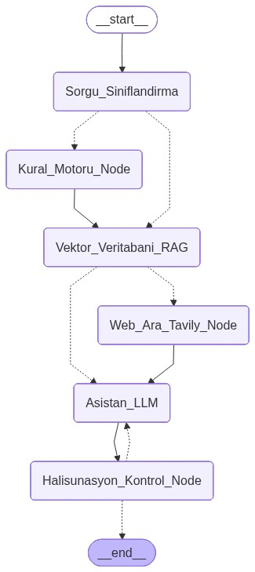

# 💊 Akıllı Eczacı Asistanı (AEA) / Smart Pharmacist Assistant (SPA)

Akıllı Eczacı Asistanı (AEA), eczacılara ilaç etkileşimleri, kullanım talimatları, yan etkiler ve genel farmakoloji konularında destek sağlayan, hibrit bir **Kural Motoru + RAG (Retrieval-Augmented Generation)** akıllı ajan sistemidir.

Bu uygulama, hem deterministik (kural tabanlı) risk kontrollerini hem de LLM destekli kanıta dayalı (KÜB/KT belgeleri üzerinden) yanıtları gelişmiş bir **LangGraph** mimarisi altında birleştirerek güvenli ve son derece profesyonel bir asistan deneyimi sunar.

---

## 🚀 Öne Çıkan Özellikler / Highlights

-   **Çift Dilli Altyapı ve Sınıflandırma (TR / EN):** Kullanıcı arayüzü ve yapay zeka çıktıları tek tıkla dil değiştirebilir. NLP sorgu sınıflandırması, varlık çıkarımı (Entity Extraction) ve sistem yönergeleri Türkçe ve İngilizce dillerine tam parite ile hizmet verecek şekilde optimize edilmiştir.
-   **LangGraph Studio Entegrasyonu:** Grafik tabanlı görsel geliştirme, izleme ve canlı test süreçleri için `langgraph.json` yapılandırması eklenmiştir. Bu sayede tüm ajan akışı LangGraph Studio üzerinden görselleştirilebilir ve debug edilebilir.
-   **Deterministik Kural Motoru (Rule Engine):** Kritik ilaç-ilaç veya ilaç-besin etkileşimleri için önceden tanımlanmış veri tabanını kullanarak %100 doğrulukta risk analizi (HIGH, LOW, NONE, UNKNOWN) sağlar.
-   **Gelişmiş RAG ve Vektör Veritabanı:** KÜB (Kısa Ürün Bilgisi) ve KT (Kullanma Talimatı) PDF'leri üzerinden anlamsal arama yaparak kanıta dayalı tıbbi açıklamalar üretir.
-   **Self-Correction (Halisünasyon Kontrolü):** Reflexion Node sayesinde model çıktıları son kullanıcıya sunulmadan önce risk çelişkileri ve uydurma tıbbi bilgilere (halisünasyon) karşı denetlenir; gerekirse model kendi cevabını otonom olarak düzeltir.
-   **Premium ve Kusursuz Tasarım (Dark/Light):** Streamlit üzerinde özel CSS seçicileriyle (örneğin `:first-of-type` ile checkbox ve toggle entegrasyonu, baseweb modal kontrast iyileştirmeleri) optimize edilmiş, göz alıcı modern bir arayüz.
-   **Kalıcı SQLite Sohbet Geçmişi:** Sohbet içeriğine göre yapay zeka tarafından otomatik isimlendirilen dinamik sohbet kayıtları.
-   **Gelişmiş Yönetici Paneli (RBAC):** Admin ve User rolleriyle yetkilendirilmiş arayüz. Admin paneli üzerinden model parametreleri (model seçimi, sıcaklık), RAG parametreleri ve kural tablosu düzenlenebilir; PDF yüklenerek vektör veritabanı canlı olarak güncellenebilir.
-   **Gözlemlenebilirlik (Observability):** LangSmith entegrasyonu ile tüm ajan adımları ve LLM çağrıları anlık olarak izlenebilir.

---

## 👩‍💻 Geliştirici Bilgileri / Developer Information

Akıllı Eczacı Asistanı (AEA), bilgisayar mühendisliği öğrencileri tarafından Prof. Dr. Ramazan Katırcı danışmanlığında geliştirilmiştir:
*   **Geliştirici Ekibi:** Cansu Öznur AVCI, Asya Mina ATİK, Elifnur ŞİMŞEK
*   **Danışman:** Prof. Dr. Ramazan Katırcı

---

## 🏗 Mimari Yapı / System Architecture

Sistem şu ana bileşenlerden oluşur:
1.  **Rule Engine (`engine/`):** CSV tabanlı kural tablosu üzerinden deterministik risk kontrolü.
2.  **Vector DB (`vector_db/`):** PDF belgelerinin gömülmesi (embeddings) ve semantik arama.
3.  **Agent Logic & Routing (`main.py`):** LangGraph tabanlı durum yönetimi (StateGraph), sorgu sınıflandırma, RAG entegrasyonu, Tavily web arama ve reflexion (öz-düzeltme) döngüleri.

Sistemin çalışma akış grafiği:


---

## 📦 Kurulum / Installation

1.  **Depoyu klonlayın ve bağımlılıkları yükleyin:**
    ```bash
    pip install -r requirements.txt
    ```

2.  **Çevresel değişkenleri yapılandırın:**
    `.env.example` dosyasını `.env` olarak kopyalayın ve API anahtarlarınızı girin.
    ```bash
    cp .env.example .env
    ```
    İçerisinde `GROQ_API_KEY`, `TAVILY_API_KEY` ve izlenebilirlik için `LANGCHAIN_API_KEY` değişkenlerinin ayarlandığından emin olun.

3.  **PDF Belgelerini İşleyin (RAG için):**
    `pdfs/` klasörüne KÜB/KT dosyalarını yerleştirin ve vektör veritabanını oluşturun:
    ```bash
    python -m vector_db.ingest_data --input-dir pdfs --clear
    ```

---

## 💻 Kullanım / Usage

### 🎨 Chatbot Arayüzü / Web UI (Streamlit)
Modern ve premium Streamlit arayüzünü başlatmak için:
```bash
streamlit run chatbot_app.py
```

### ⌨️ CLI / Komut Satırı Testi
Doğrudan terminal üzerinden ajanı çalıştırmak için:
```bash
python main.py "Parasetamol ile Alkol etkileşimi nedir?"
```

### 🛠 LangGraph Studio (Görsel Debug ve Geliştirme)
LangGraph Studio veya CLI üzerinden grafiği ayağa kaldırmak için:
```bash
langgraph dev
```

---

## 🔍 Gözlemlenebilirlik / Observability

Sistem, **LangSmith** ile tam uyumludur. `.env` dosyasında LangSmith değişkenlerini aktif ettiğinizde, sistem LangGraph Studio ve Streamlit üzerinden yapılan tüm sorgu izlerini (traces) gerçek zamanlı olarak yakalar. Bu sayede ajanın karar ağacını ve RAG süreçlerini anlık olarak izleyebilirsiniz.

---

## ⚠️ Yasal Uyarı / Disclaimer

Bu sistem bir **karar destek arayüzüdür**. Üretilen yanıtlar tıbbi tavsiye niteliği taşımaz. Nihai karar her zaman uzman bir sağlık profesyoneli (Doktor veya Eczacı) tarafından verilmelidir.

