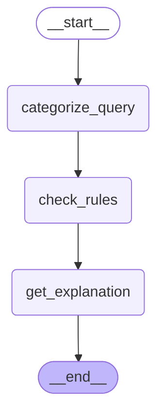

```mermaid
graph TD;
	__start__([<p>__start__</p>]):::first
	categorize_query(categorize_query)
	check_rules(check_rules)
	get_explanation(get_explanation)
	__end__([<p>__end__</p>]):::last
	__start__ --> categorize_query;
	categorize_query --> check_rules;
	check_rules --> get_explanation;
	get_explanation --> __end__;
	classDef default fill:#f2f0ff,line-height:1.2
	classDef first fill-opacity:0
	classDef last fill:#bfb6fc
```